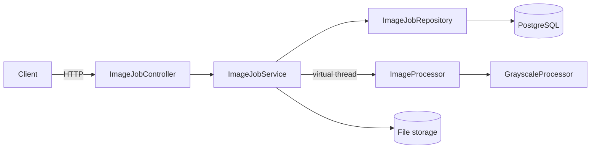

# Image Job Service


A Spring Boot REST service that accepts image uploads, processes them asynchronously in the background, and tracks each job's state in PostgreSQL.

Uploading returns immediately with a job ID. Processing runs on Java 21 virtual threads, and clients poll the job's status and download the result when it's done. This is the same asynchronous job-queue pattern used for video transcoding, report generation, or model inference, with grayscale conversion as the current processing step.

## Features

- Upload an image and get a job ID back immediately
- Background processing on virtual threads, with job states `PENDING → RUNNING → DONE / FAILED`
- Error handling: unsupported files end as `FAILED` with an error message
- Pluggable processing through an `ImageProcessor` interface
- Unit tests with JUnit 5, AssertJ and Mockito
- CI with GitHub Actions, running the tests against a real PostgreSQL service
- One-command setup with Docker Compose

## Architecture



The controller handles HTTP, the service holds the business logic, and the repository handles persistence. The service depends on the `ImageProcessor` interface rather than a concrete implementation, so new processing backends can be added without changing it.

## Tech stack

Java 21 · Spring Boot · Spring Data JPA / Hibernate · PostgreSQL · JUnit 5 · Mockito · Docker · GitHub Actions

## Getting started

Requirements: Docker.

```bash
git clone https://github.com/lornalelcaj/image-job-service.git
cd image-job-service
docker compose up --build
```

The API is then available at `http://localhost:8080`.

## API

| Method | Endpoint | Description |
|---|---|---|
| `POST` | `/jobs` | Upload an image (multipart field `file`), returns the new job |
| `GET` | `/jobs` | List all jobs |
| `GET` | `/jobs/{id}` | Get a job's status |
| `GET` | `/jobs/{id}/result` | Download the processed PNG (`409` if not finished) |

Example:

```bash
curl -F "file=@photo.jpg" http://localhost:8080/jobs
# {"id":1,"filename":"photo.jpg","status":"PENDING", ...}

curl http://localhost:8080/jobs/1
# {"id":1,"filename":"photo.jpg","status":"DONE", ...}

curl -o result.png http://localhost:8080/jobs/1/result
```

## Running the tests

The unit tests need nothing extra. The Spring startup test needs PostgreSQL on `localhost:5432`:

```bash
docker run --name imagejobs-db -e POSTGRES_USER=imagejobs -e POSTGRES_PASSWORD=imagejobs \
  -e POSTGRES_DB=imagejobs -p 5432:5432 -d postgres:16
./mvnw test
```

## Roadmap

- Jigsaw puzzle generation: cut an uploaded image into puzzle pieces, generated in parallel
- Angular frontend for uploading images and viewing the generated pieces
- Limit on concurrently running jobs, and optimistic locking on job updates
- CUDA-based processing backend, benchmarked against the CPU implementation
